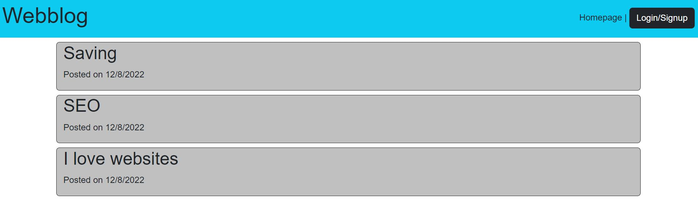
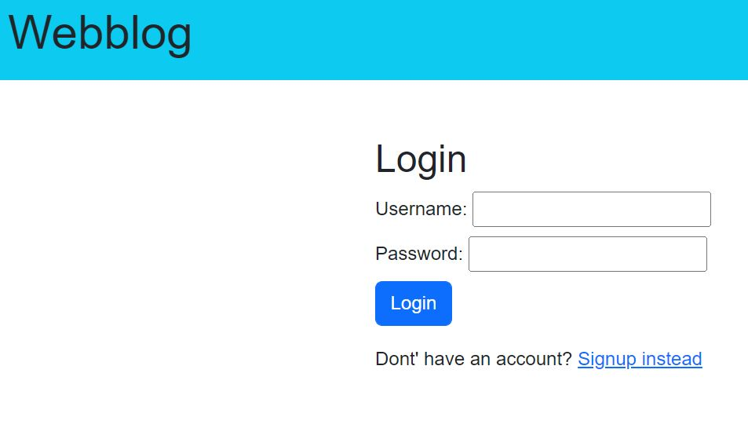
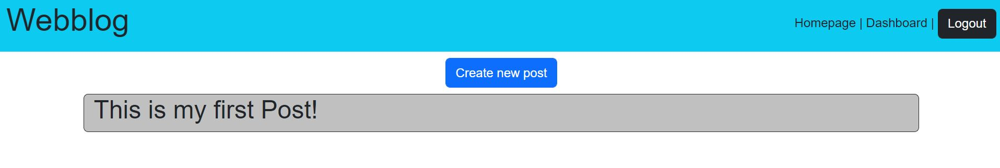
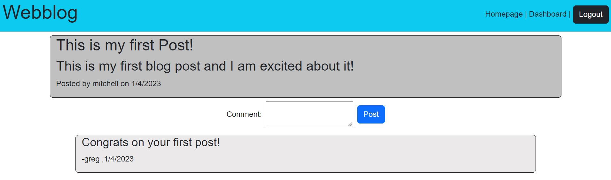

# Model-View-Controller (MVC): Tech Blog

## Description

This project is a full stack app that uses the Model-View-Controller (MVC) framework. The app is a tech blog where users can create and view posts about web development. This project was built using MySQL2, Express.js, Sequelize, dotenv, bcrypt, express-handlebars, and express-session.

## Link

[Link to deployed app](https://techblogblog.herokuapp.com/)

## Installation

To run the app locally, the necessary dependencies can be installed by running `npm i` in the command line.

## Usage

>When users first visit the app they will see the homepage. 
>

>To begin using the app, users must first log in or sign up. Only authenticated users can view and create posts. 
>

>The dashboard will show the posts that the user has created. By clicking on the title of a post from the dasboard, users can update or delete their posts. 
>

>On the homepage, users can click on the title of a post to view who created the post and the date when it was created. Users can also leave comments on posts. 
>

## License
MIT license. Please refer to the license in the repo